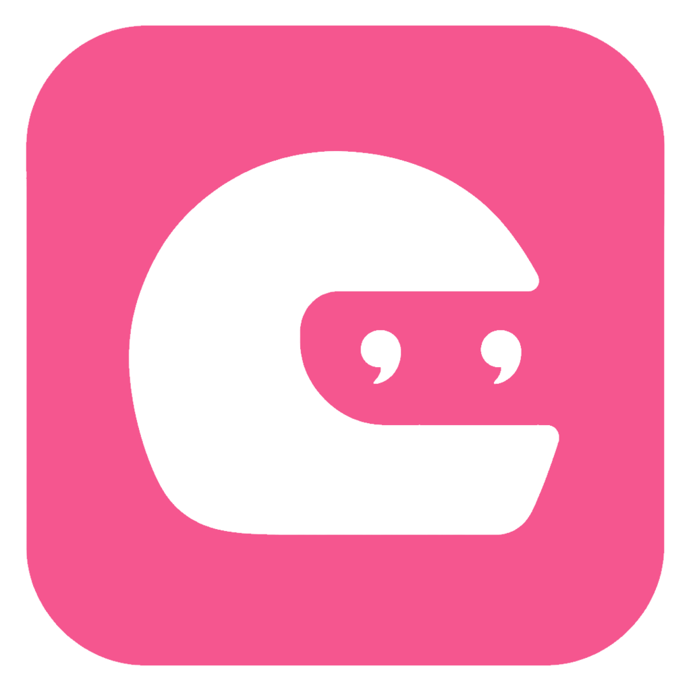
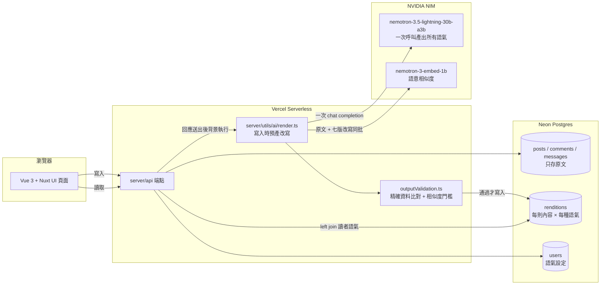
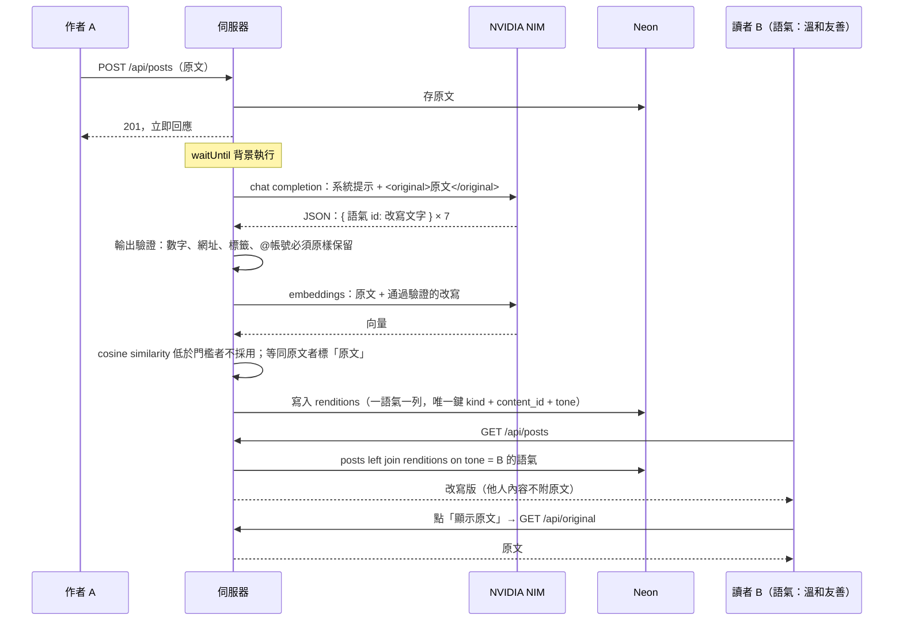
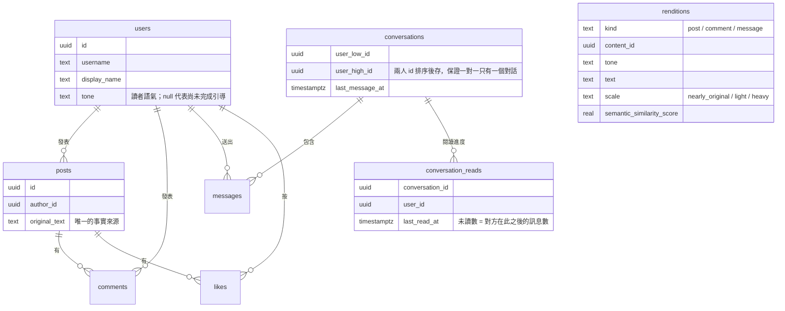

<p align="center">
  
</p>

<h1 align="center">不痛 Tone</h1>

<p align="center">
  社群平台的「語氣層」：作者寫什麼就存什麼，每位讀者自己選要用什麼語氣讀別人的話。<br>
  戴上安全帽，別人的話砸下來就不痛。
</p>

<p align="center">
  <a href="https://ai-social-alex-sus-projects.vercel.app">線上 Demo</a>｜
  <a href="#技術架構">技術架構</a>｜
  <a href="#執行方式">執行方式</a>｜
  <a href="#來源說明">來源說明</a>
</p>

> BUILDMODE GEN-AI HACKATHON 2026（FUTUREMODE × SITCON）參賽作品，2026.09.04–06 於台北花博爭艷館開發。

---

## 問題與解法

社群上的文字帶著作者的語氣與情緒一起送到讀者面前。讀者沒有選擇權，只能被酸言、攻擊或過激情緒帶著走；作者則因為揣測讀者反應而自我審查。既有解法都在「刪」：檢舉、封鎖、字詞過濾，把內容拿掉，而不是換一種方式讀。

**不痛 Tone** 在作者與讀者之間加一層語氣層：

- **原文只有一份。** 貼文、留言、私訊一律以原話存進資料庫，沒有 AI 潤飾、沒有預覽，作者不需要揣測。
- **讀者選語氣。** 每位讀者在引導設定選一種語氣（溫和友善、客觀中立、清楚簡潔、文青風、黃山料體、財哥體、LinkedIn 感謝風），之後看到的所有他人內容都以這個語氣呈現。同一則貼文在兩支手機上長得不一樣。
- **隨時看原文。** 每則內容都能一鍵切回原話，並標示改寫幅度，讀者不會被誤導。
- **同一句話在兩端不一樣。** 私訊是最貼身的場景：你用力罵，對方用溫和語氣收到；對方冷冷回，你可以用友善語氣讀。

改寫只改語氣，不改語意：不可曲解立場、不可更動事實、數字、人物、時間與結論。這條不變量寫在模型的系統提示裡，也由伺服器端的輸出驗證與語意相似度把關。

## 功能一覽

| 區域 | 功能 |
|---|---|
| 動態牆 | 依時間排序的貼文、按讚、留言串、第一則留言預覽 |
| 貼文頁 | 全部留言、「顯示原文」、改寫幅度標籤、語意相似度 |
| 聊天 | 1：1 私訊、最後一則訊息預覽、未讀數量、每秒輪詢新訊息 |
| 個人頁 | 自己的貼文、登出 |
| 語氣設定 | 引導設定時選語氣、之後可在設定頁切換；切換後全站內容立即換語氣 |
| 內容管理 | 刪除自己的貼文與留言，改寫一併清除 |

## 技術架構

單一 Nuxt 4 全端專案：前端 Vue 3 ＋ Nuxt UI，後端是 Nuxt server routes（Nitro），部署在 Vercel 的 serverless function，資料庫是 Neon Postgres，語言模型走 NVIDIA NIM 的 OpenAI 相容端點。



### 寫入時預產，讀取時零模型呼叫

改寫只在內容寫入時產生一次，對七種語氣各存一份、全站共用；之後任何讀者切任何語氣都是資料庫查詢，動態牆載入不會碰到模型。這讓讀取延遲穩定，也把模型費用鎖在「每則內容一次呼叫」。



### 語氣層的三道防線

| 防線 | 位置 | 做什麼 |
|---|---|---|
| 系統提示 | `server/utils/ai/prompt.ts` | 不變量寫在最前面：只改語氣不改語意、保留人稱與視角、不摘要、段句數不得少於原文；依內容類型說明誰在對誰說話（私訊裡的「你」就是讀者）；`<original>` 標記把內容當資料，擋提示注入。刻意不附範例句，實測 30B 模型會把範例原字抄進輸出 |
| 輸出驗證 | `server/utils/ai/outputValidation.ts` | 全部是不呼叫模型的確定性檢查：原文的網址、數字（含單位）、`#標籤`、`@帳號` 少一個就整筆作廢；人稱跑掉（「我」變「作者」）、描述原文而非改寫（「這段文字表達……」）、抄到語氣範例句、句數或字數砍掉太多，也各自作廢 |
| 語意相似度 | `server/utils/ai/semanticSimilarity.ts` | 原文與改寫的 embedding cosine similarity，低於門檻不寫入。校準結果顯示它只能擋「離題」，擋不住否定翻轉與數字改動，所以門檻設得寬，精確資料交給上一道 |

改寫失敗（逾時、限流、驗證不過）時該語氣留空，讀者看到原文並標示「原文」；模型永遠不會成為讀不到內容的原因。

### 資料模型



`renditions` 沒有外鍵指向三張內容表（`content_id` 橫跨三種內容），由刪除端點順手清除。

### 目錄結構

| 路徑 | 內容 |
|---|---|
| `app/` | Nuxt 4 前端：`pages/`（動態牆、貼文、聊天、個人、設定、引導）、`components/`、`composables/` |
| `server/api/` | HTTP 端點，只做取 session、驗輸入（zod）、整形回應 |
| `server/utils/ai/` | 改寫管線：`prompt.ts`、`nvidia.ts`（金鑰輪替）、`render.ts`（預產）、`outputValidation.ts`、`semanticSimilarity.ts`、`scale.ts` |
| `server/utils/` | 其他領域邏輯：對話、使用者、session、密文 |
| `server/db/` | Drizzle schema、連線、migrations |
| `shared/` | 前後端共用：語氣清單（`utils/tones.ts`）、內容常數、API 型別 |
| `scripts/` | 預建帳號與 demo 內容的 seed 腳本 |
| `tests/` | `node --test` 單元測試（輸出驗證、相似度、提示組裝、改寫幅度） |
| `backlog/` | Backlog.md 管理的 PRD（`docs/`）、決策紀錄（`decisions/`）、任務（`tasks/`） |
| `docs/` | 部署說明、語意相似度校準紀錄、簡報用架構圖 |
| `CONTEXT.md` | 領域詞彙表：每個概念的正式名稱、程式識別碼與該避免的同義詞 |

### 主要端點

| 方法與路徑 | 用途 |
|---|---|
| `POST /api/auth/login`、`POST /api/auth/logout` | 預建帳號登入、登出（cookie session） |
| `GET /api/me`、`PATCH /api/me/settings` | 目前登入者、更新語氣 |
| `GET /api/posts`、`POST /api/posts` | 動態牆（游標分頁）、發文 |
| `GET /api/posts/:id`、`DELETE /api/posts/:id` | 貼文頁、刪文 |
| `GET/POST /api/posts/:id/comments`、`POST /api/posts/:id/like` | 留言、按讚 |
| `GET /api/original?kind=&id=` | 讀者主動要求原文 |
| `GET /api/renditions?kind=&id=` | 預產未完成時前端輪詢改寫 |
| `GET /api/conversations`、`POST /api/conversations/with/:userId` | 聊天列表（含預覽與未讀數）、開啟對話 |
| `GET/POST /api/conversations/:id/messages` | 拉訊息（`after` 游標；拉到即視為已讀）、送訊息 |
| `POST /api/admin/prerender` | 以 `x-admin-secret` 保護，補齊既有內容缺少的語氣改寫 |

## 執行方式

### 需求

- Node.js 24、pnpm 10
- Neon Postgres 連線字串（或任何 Postgres）
- NVIDIA NIM 金鑰（[build.nvidia.com](https://build.nvidia.com) 免費申請），沒有金鑰也能跑，只是內容不會被改寫

### 本機

```bash
cp .env.example .env            # 填 DATABASE_URL、NUXT_SESSION_SECRET、NUXT_AI_NVIDIA_API_KEYS
pnpm install
pnpm db:migrate                 # 套用 server/db/migrations
cp scripts/seed-users.example.json scripts/seed-users.json   # 改成自己的帳號名單
pnpm db:seed                    # 建立帳號與 demo 內容
pnpm dev                        # http://localhost:3000
```

### 環境變數

| 變數 | 說明 |
|---|---|
| `DATABASE_URL` | Postgres 連線字串 |
| `NUXT_SESSION_SECRET` | session cookie 簽章金鑰 |
| `NUXT_AI_NVIDIA_API_KEYS` | NIM 金鑰，逗號分隔多把會輪替；撞到限流自動換下一把 |
| `NUXT_AI_MODEL` | 改寫模型，預設 `nvidia/nemotron-3.5-lightning-30b-a3b` |
| `NUXT_AI_EMBEDDING_MODEL` | 相似度 embedding 模型，預設 `nvidia/nemotron-3-embed-1b` |
| `NUXT_ADMIN_SECRET` | 管理端點密鑰；沒設則端點不存在 |

### 測試與檢查

```bash
pnpm test        # node --test tests/*.test.mjs
pnpm typecheck   # nuxt typecheck
pnpm lint        # eslint
```

### 部署

Vercel 零設定部署（repo root 即 Nuxt app），`vercel.json` 把 function 釘在 `iad1` 以貼近 Neon 所在的 `us-east-1`。背景預產靠 `waitUntil`，函式時限設為 60 秒。分支對應與 migration 流程見 [docs/DEPLOYMENT.md](docs/DEPLOYMENT.md)。

## 設計取捨

- **同一語氣所有讀者共用一份改寫**，而非每位讀者各自產生。demo 規模下省下 N 倍模型呼叫，也讓「你看到的和另一位選同語氣的人一樣」可以被驗證。
- **一次呼叫回七種語氣的 JSON**，而不是每種語氣各打一次。NIM 有每分鐘請求上限，這讓一則內容只佔一個配額。
- **短輪詢而非 WebSocket**：Vercel serverless 不支援長連線，demo 規模下每秒一次輪詢完全夠用。
- **未讀只記錄讀者自己的進度**，不做對方已讀回條，與「改寫只影響讀者這一端」的原則一致。
- **相似度門檻刻意設寬**：本地校準顯示 embedding 對否定翻轉、數字改動幾乎無辨識力，把它當作品質閘門會誤殺風格強烈但忠實的改寫。詳見 [docs/SEMANTIC_SIMILARITY_CALIBRATION.md](docs/SEMANTIC_SIMILARITY_CALIBRATION.md)。

每一項取捨都有一則 ADR 在 `backlog/decisions/`，PRD 在 `backlog/docs/`。

## 來源說明

本專案於黑客松期間（2026.09.04–06）從零開始，沒有沿用團隊既有程式碼。使用的第三方資源如下：

| 類別 | 項目 | 授權 |
|---|---|---|
| 框架與套件 | Nuxt 4、Vue 3、Nuxt UI、Tailwind CSS、Drizzle ORM、zod、VueUse、openai（Node SDK，用於呼叫 OpenAI 相容端點） | MIT |
| 模型 | NVIDIA `nemotron-3.5-lightning-30b-a3b`（改寫）、`nemotron-3-embed-1b`（embedding），透過 NVIDIA NIM 端點呼叫 | NVIDIA Open Model License |
| 基礎設施 | Vercel（部署）、Neon（Postgres） | 服務條款 |
| 字型與圖示 | Noto Sans TC（Google Fonts）、MingCute Icons（透過 `@iconify-json/mingcute`） | SIL OFL 1.1、Apache 2.0 |
| 開發工具 | Claude Code 用於協作撰寫程式、規格文件與 demo 資料；Backlog.md 管理任務與 ADR | — |
| Demo 資料 | 預建帳號與貼文由團隊撰寫或參賽者現場輸入，部分為網路流行的迷因文字，僅供 demo，不屬本專案授權範圍 | — |

「黃山料體」「財哥體」為對特定公開人物寫作風格的戲仿，只作為語氣範例，無任何商業使用。

## 授權

[MIT](LICENSE)
