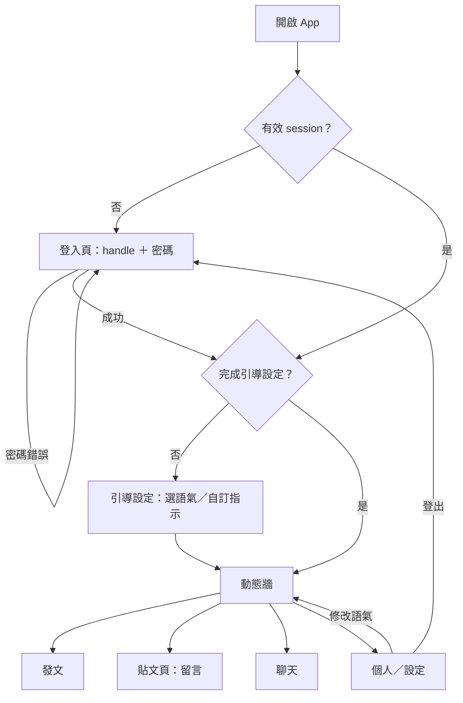

## 1. 背景與問題（Why）

社群平台上的文字帶著作者的語氣與情緒一起送到讀者面前。讀者沒有選擇權，只能被酸言、攻擊或過激情緒帶著走；作者則因為揣測讀者反應而自我審查，寫不出真正想說的話。既有的解法都在「刪」——檢舉、封鎖、字詞過濾——把內容拿掉而不是換一種方式讀。

AI Social 在作者與讀者之間加一層**語氣層**：貼文、留言、訊息一律以原文存放，每位讀者用自己選的語氣閱讀**他人**的內容。作者寫什麼就存什麼，沒有 AI 潤飾、沒有預覽；讀者可以把激烈的話緩和成自己受得了的樣子，也可以反過來選犀利。同一則內容在兩支手機上截然不同，資料庫裡永遠只有一份原文。

除了閱讀體驗，這層機制也是面對網路霸凌、兒少保護等嚴肅議題的一種讀者端解法：加害內容不被刪除，但抵達讀者時已被緩和。

本產品為 BUILDMODE GEN-AI HACKATHON 2026（09.04–06）參賽作品，demo 以「兩位使用者不同語氣設定，同看一則剛發出的貼文」為高潮。產品架構參考 Threads 這類內容導向的短文平台，不做社團、市集等周邊。

## 2. 使用者與場景

目標使用者是 demo 期間的十幾位預建帳號（隊友、評審、來賓）。沒有註冊功能，帳號由團隊直接在資料庫建立。

- 當我看到情緒激烈的貼文時，我想要用溫和的語氣閱讀，以便不被情緒帶著走。
- 當我想發文時，我想要寫什麼就送出什麼、不看預覽，以便不去揣測讀者會怎麼想。
- 當我和人私訊時，我想要對方的訊息用我選的語氣呈現，以便對話不因用字起衝突。
- 當我懷疑改寫失真時，我想要一鍵看到原文，以便確認自己沒被誤導。
- 當我第一次登入時，我想要先選好語氣再進入 App，以便從第一則貼文起就是我要的樣子。

## 3. 需求細節

### 3.1 帳號與登入

| # | 功能／需求 | 完成目標 |
|---|---|---|
| 1 | 預建帳號：無註冊功能，帳號（handle、顯示名稱、密碼）由團隊直接寫入資料庫 | 介面上不存在註冊入口；資料庫沒有的 handle 無法登入 |
| 2 | 登入：handle ＋ 密碼。密碼是團隊指定的短碼（例如 8 碼數字），明文存放，demo 結束即關閉服務 | 正確密碼建立 30 天有效的 session；handle 不存在與密碼錯誤顯示同一則錯誤訊息 |
| 3 | 未登入不可用 | 未登入開任何頁面都被導向登入頁，API 一律回 401 |
| 4 | 登出 | 登出後 session 失效，回到登入頁 |

### 3.2 引導設定（onboarding）

| # | 功能／需求 | 完成目標 |
|---|---|---|
| 1 | 首次登入強制進入引導設定：選語氣（預設清單或自訂語氣指示）；完成前不能進入 App | 未完成引導設定的帳號開任何頁面都被導回引導設定 |
| 2 | 設定頁可隨時修改同樣的內容 | 修改後回到動態牆，他人內容以新設定重新改寫 |
| 3 | 自備金鑰管理：新增或更新 Anthropic／OpenAI 金鑰，只顯示尾四碍 | 金鑰明文不回傳前端；儲存後改寫改用自備金鑰 |

引導設定要問哪些項目，以語氣改寫引擎 PRD 的語氣設定為準；目前只問語氣相關設定，顯示名稱由團隊建帳號時給定，頭像用 handle 首字加固定色。

### 3.3 語氣層總則（各模組共同遵守）

| # | 功能／需求 | 完成目標 |
|---|---|---|
| 1 | 原文是唯一事實來源，改寫永不回寫 | 任何改寫路徑都無法修改原文欄位 |
| 2 | 只改寫他人的內容；自己的貼文、留言、訊息永遠顯示原文 | 作者在任何語氣設定下看到自己的內容都與送出時逐字相同 |
| 3 | 每則他人內容都有小標籤「AI 改寫」或「原文」 | 讀者選「不改寫」、改寫失敗、或點了「顯示原文」時標「原文」，其餘標「AI 改寫」並附改寫幅度 |
| 4 | 顯示原文：他人內容可一鍵切回原文，一次性、不改全站設定 | 切回原文不觸發模型呼叫；再點一次回到改寫版 |
| 5 | 改寫失敗或無可用金鑰時不阻擋 | 顯示原文＋「原文」標籤；頂部提示引導使用者填自備金鑰；瀏覽、發文、留言、聊天皆不受影響 |

### 3.4 導覽與版面

手機優先。底部分頁四個：動態牆、發文、聊天、個人（含設定）。桌面版沿用同一版面置中，不另做。

### 3.5 刻意不做

以下皆為做得到但現階段刻意不做，理由是不影響 demo 故事、或投入產出不划算：註冊、密碼重設、Email 驗證、OAuth、密碼雜湊；追蹤與好友關係、推薦演算法、轉發與引用、通知、搜尋、hashtag；圖片與影音；群聊、WebSocket 即時通訊、已讀與輸入中狀態；封鎖與檢舉；留言的讚；多語系。

### 3.6 第二階段候選

- 語音朗讀：他人內容以讀者語氣朗讀（ElevenLabs），金鑰沿用自備金鑰與共用池機制。
- 貼文編輯：編輯即直接改原文，既有改寫全部作廢。
- 有害內容偵測：改寫時順帶標記攻擊、威脅、違法內容，讀者端警示或摺疊。

## 4. 子 PRD 索引

| PRD | 內容 |
|---|---|
| 語氣改寫引擎 PRD（doc-002） | 語氣設定的值域、改寫不變量、改寫服務契約、觸發時機、改寫幅度、金鑰解析 |
| 社群內容 PRD（doc-003） | 動態牆、發文、留言、讚、個人頁 |
| 聊天室 PRD（doc-004） | 1：1 私訊、輪詢、訊息改寫 |

## 5. 流程圖

