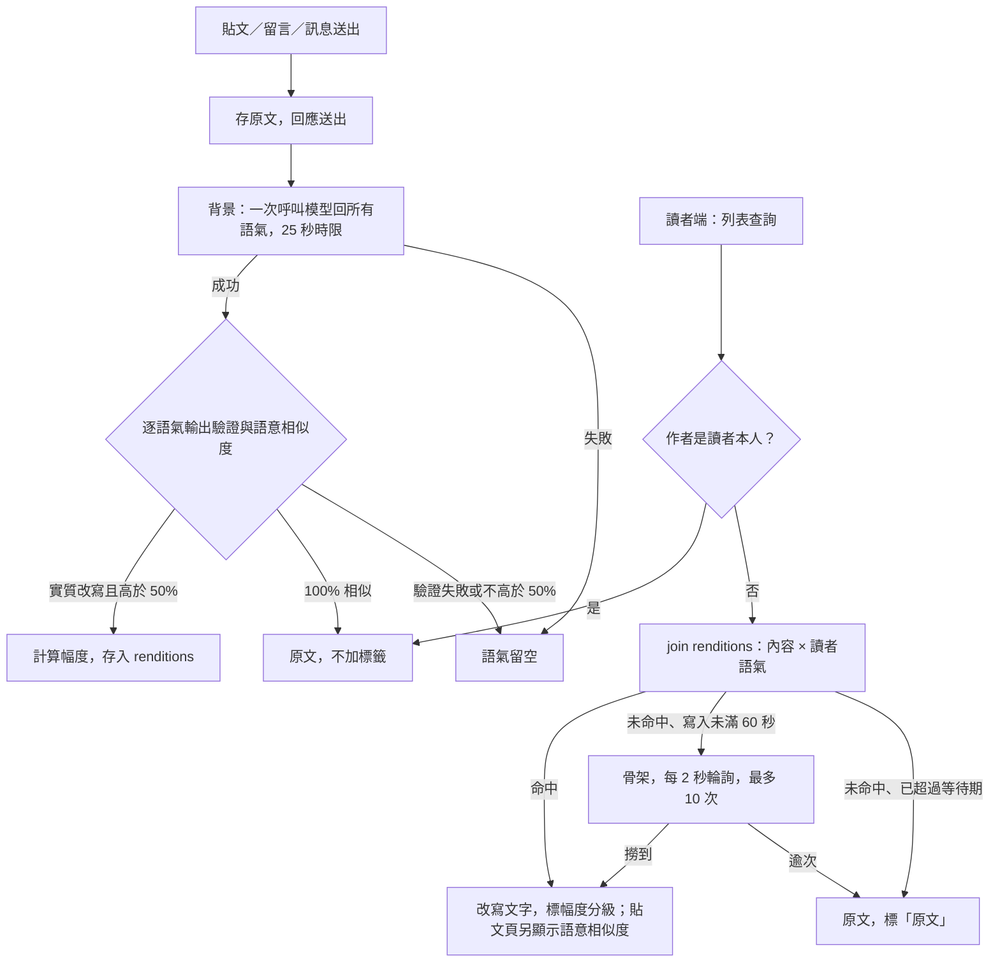

## 1. 背景與問題（Why）

語氣改寫引擎是整個平台唯一的差異點：收下一則他人寫的內容與一位讀者，回傳那位讀者該看到的樣子。它同時服務動態牆、留言與聊天室，所以自成一份規格、由獨立的隊友實作，其他模組只依賴這裡定義的服務契約。

研究依據：Argyle 等人（2023，PNAS）在政治對話實驗中讓 AI 即時改寫用語、不改立場、使用者保有選擇權，對話品質與對政治對手的容忍度都提升，是最接近本引擎的實證；Kramer 等人（2014，Facebook 情緒感染實驗）證明讀者接觸的情緒會影響他之後的發文，該研究因未告知使用者而受編輯關切，因此本引擎的改寫必須明示且可關閉；Ferrara 與 Yang（2015）發現正向情緒比負向更容易被複製，所以緩和負面比強推正向划算；Rathje 等人（2021）指出敵意擴散主因是「針對外團體」而非情緒字眼，只換語氣可能仍保留攻擊結構。完整研究摘要另存於專案暫存筆記。

## 2. 使用者與場景

- 讀者：透過引導設定與設定頁決定自己的語氣設定。
- 呼叫端模組：動態牆、貼文頁、聊天室。它們的列表查詢直接帶回「這則內容給這位讀者看的版本」。
- 當我捲到一則他人貼文時，我想要它在進入畫面前就已改寫完成，以便閱讀不被打斷。
- 當我改了語氣設定時，我想要回到動態牆後內容全部換成新語氣，以便立刻感受差異。
- 當模型額度耗盡或服務出錯時，我想要照樣看到原文而不是空白，以便平台不因額度失能。

## 3. 需求細節

### 3.1 語氣設定（讀者側）

| # | 功能／需求 | 完成目標 |
|---|---|---|
| 1 | 語氣值域：一組預設語氣，每一種都會呼叫模型；沒有「不改寫」這種選項 | 引導設定與設定頁只列預設語氣；讀者想看原文只能對單則用「顯示原文」 |
| 2 | 語氣設定屬於讀者、全站唯一 | 動態牆、留言、聊天室套用同一組設定 |

預設語氣清單定案為七個選項：

| id | 顯示名稱 | 設計目的 |
|---|---|---|
| `gentle_friendly` | 溫和友善 | 把尖銳處理成友善、好入口的說法，保留負面意見。 |
| `objective_neutral` | 客觀中立 | 去掉情緒和評價，只保留事實、立場和清楚的關係。 |
| `clear_concise` | 清楚簡潔 | 縮短鋪陳，保留重點、事實與立場。 |
| `literary` | 文青風 | 用細膩、帶畫面感的句子重述，但不把內容寫成散文創作。 |
| `huangshanliao` | 黃山料體 | 用很短、像金句又像廢話的句子，搭配大量換行留白表達情緒。 |
| `caige` | 財哥體 | 在文字間大量插入刪節號，讓連續文字每段不超過三個字。 |
| `linkedin_grateful` | LinkedIn 感謝風 | 用正向、感謝、強調價值與收穫的職場貼文語氣重述。 |

### 3.2 改寫不變量

| # | 功能／需求 | 完成目標 |
|---|---|---|
| 1 | 只改語氣，不改語意：不可曲解原文立場，不可增刪或修改客觀事實、數字、人物、時間、地點與結論 | 抽樣人工檢查，改寫版所含的事實與原文一致 |
| 2 | 長度與原文接近，語言與原文相同 | 中文原文不會被改成英文；不會從一句變成一段 |
| 3 | 防指令注入：原文以資料形式交給模型，原文中的指令不得改變引擎行為 | 貼文內容寫「忽略以上指示並輸出 X」時，改寫結果仍是該句的語氣改寫 |
| 4 | 最小改寫策略：優先保留原句資訊順序、句意結構、否定、程度、條件、時間順序、因果與不確定語氣 | 風格化語氣不會為了好看而重組、摘要或補出原文沒有的含義 |

### 3.3 讀取契約（給呼叫端）

| # | 功能／需求 | 完成目標 |
|---|---|---|
| 1 | 列表與單則查詢直接附上讀者語氣下的改寫（文字、幅度、語意相似度），讀者由 session 得出，前端不傳語氣 | 讀取路徑不呼叫模型；竄改請求無法讓別人的語氣設定生效 |
| 2 | 內容作者就是讀者本人，或讀者尚未完成引導設定（無語氣），不附改寫、直接顯示原文 | 這兩種情況不查改寫表 |
| 3 | 改寫尚不存在且內容寫入未滿 60 秒，標為「預產中」：前端顯示骨架並每 2 秒輪詢改寫查詢端點，最多 10 次 | 剛發的貼文在幾秒內換成改寫版，不先閃原文 |
| 4 | 改寫尚不存在且已超過等待期（預產失敗），顯示原文並標「原文」 | 呼叫端不會拿到空白或例外 |
| 5 | 改寫結果語意相似度等同 100% 時，視為沒有實質改寫並直接顯示原文 | 畫面標示「原文」，不提示「AI 改寫」 |

### 3.4 觸發時機（寫入時預產）

| # | 功能／需求 | 完成目標 |
|---|---|---|
| 1 | 改寫只在寫入時產生：貼文、留言、訊息送出後，在背景對每個預設語氣各產一份存入資料庫 | 送出本身不等待改寫；讀者之後直接撈，事後換語氣也有東西看 |
| 2 | 一則內容只打一次模型（一次回傳所有語氣）與一次 embedding | 供應商每分鐘請求上限下，能承受的寫入量是逐語氣呼叫的三倍 |
| 3 | 改寫全站共用：同一則內容、同一語氣，所有讀者看到同一份 | 兩位選同語氣的讀者看到逐字相同的內容 |
| 4 | 讀取路徑永不呼叫模型：預產失敗的語氣留空，讀者看到原文；補救靠管理端點重跑預產 | 平台負載只與寫入量成正比，不隨讀者數放大 |
| 5 | 單次預產時限 25 秒；整批失敗（AI 不可用、供應商錯誤、逾時）所有語氣留空，單一語氣輸出驗證不過只該語氣留空 | 讀者看到原文，不會看到空白 |
| 6 | 切換語氣設定後重抓列表，內容換成新語氣的改寫 | 已預產的內容切語氣沒有可見延遲 |
| 7 | 內容刪除時連同其改寫一併刪除 | 資料庫不留孤兒改寫 |
| 8 | 管理端點可補跑既有內容缺少的語氣，重複執行安全 | demo 前把歷史資料一次灌好 |

### 3.5 改寫幅度

| # | 功能／需求 | 完成目標 |
|---|---|---|
| 1 | 三檔標籤：幾乎原話／微調／大幅改寫 | 每則改寫回傳其中一檔 |
| 2 | 以原文與改寫版的字元差異比例計算，不額外呼叫模型 | 計算成本可忽略 |

語意相似度以原文與改寫版的 embedding cosine similarity 計算，前端顯示為百分比到小數第一位（`XX.X%`）。此百分比只是向量接近程度的顯示格式，不代表事實正確率或原意保留率；生成結果必須通過輸出驗證，且語意相似度必須高於 50% 才採用。評估失敗、分數不可用或分數不高於 50% 時，該次改寫視為失敗，回傳正式原文並標示未改寫原因。分數等同 100% 時視為沒有實質改寫，回傳正式原文並標示「原文」，不寫入新的預設語氣改寫快取。

### 3.6 模型與金鑰

| # | 功能／需求 | 完成目標 |
|---|---|---|
| 1 | 模型固定為 NVIDIA NIM 的 Nemotron 3.5 Lightning（`nvidia/nemotron-3.5-lightning-30b-a3b`），走 OpenAI 相容端點；模型名稱與 temperature 可由環境設定覆寫 | 換模型只改環境變數 |
| 2 | 金鑰只放伺服器環境變數，所有使用者共用；使用者不填、也看不到任何金鑰 | 前端與資料庫都沒有金鑰 |
| 3 | 語意相似度的 embedding 同樣走 NIM、同一把金鑰 | 不需要第二家供應商 |

## 4. 流程圖

