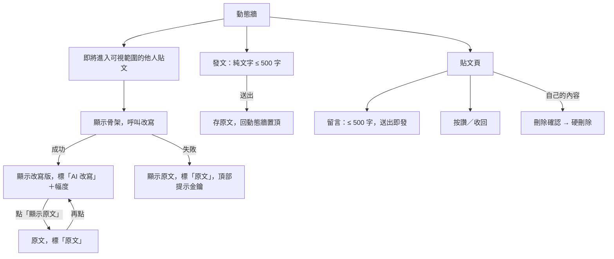

## 1. 背景與問題（Why）

社群內容是語氣層的載體：沒有貼文、留言與一條時間軸，改寫引擎無處施展。本 PRD 定義 Threads 式的最小內容模型——一條全站時間序、純文字貼文、一層留言、讚——並規定它們如何與語氣層互動：他人內容經改寫呈現，自己的內容永遠是原文。

## 2. 使用者與場景

- 當我打開 App 時，我想要看到所有人最新的貼文，以便知道大家在說什麼。
- 當我有話想說時，我想要打完直接送出、沒有預覽、沒有 AI 介入，以便不去顧慮別人怎麼看。
- 當我對一則貼文有想法時，我想要留言，以便回應作者。
- 當我看到喜歡的貼文時，我想要按讚，以便讓作者知道。
- 當我後悔發了某則貼文時，我想要刪掉它，以便它不再出現。
- 當我點進某個人時，我想要看他所有的貼文，以便了解這個人。

## 3. 需求細節

### 3.1 動態牆

| # | 功能／需求 | 完成目標 |
|---|---|---|
| 1 | 全站單一時間序，最新在上，所有人的貼文所有人都看得到 | 沒有任何篩選或排序選項 |
| 2 | 游標式無限捲動，每頁 20 則 | 捲到底自動載入下一頁，不重複、不漏 |
| 3 | 頂部「載入新貼文」按鈕或返回動態牆時載入新貼文，插到最上方且不打掉已捲到的頁 | 別人剛發的貼文在重新載入後出現在最上方 |
| 4 | 貼文卡：頭像（username 首字＋固定色）、顯示名稱、username、相對時間、內容、語氣標籤與改寫幅度、讚數、留言數 | 所有欄位齊備，點卡片進入貼文頁 |
| 5 | 他人貼文在改寫完成前顯示骨架（作者列＋內容佔位），不顯示原文 | 讀者不會先看到原文再跳成改寫版 |
| 6 | 自己的貼文直接顯示原文，標「原文」 | 不觸發改寫 |

### 3.2 發文

| # | 功能／需求 | 完成目標 |
|---|---|---|
| 1 | 純文字，上限 500 字，即時字數顯示 | 超過上限不能送出 |
| 2 | 送出即發布：沒有預覽、沒有 AI 潤飾、沒有草稿 | 資料庫存的與輸入框內容逐字相同 |
| 3 | 空白或只有空格不能送出 | 送出鈕停用 |
| 4 | 發布成功回到動態牆，新貼文在最上方 | 不等待任何改寫 |

### 3.3 貼文頁與留言

| # | 功能／需求 | 完成目標 |
|---|---|---|
| 1 | 貼文頁：貼文本體＋留言列表（舊到新）＋留言輸入框 | 與動態牆同一張貼文卡樣式 |
| 2 | 留言一層，不做樓中樓；純文字上限 500 字；送出即發布 | 留言只能掛在貼文下 |
| 3 | 他人留言經改寫呈現並帶標籤；自己的留言顯示原文 | 與貼文規則一致 |
| 4 | 留言數即時反映在貼文卡 | 新增或刪除後計數正確 |

### 3.4 讚

| # | 功能／需求 | 完成目標 |
|---|---|---|
| 1 | 貼文可按讚與收回，一人一讚 | 重複點擊只切換狀態，計數不重複累加 |
| 2 | 讚數顯示在貼文卡與貼文頁，點擊立即回饋 | 不等待伺服器回應就更新畫面，失敗則回復 |
| 3 | 留言不能按讚 | — |

### 3.5 刪除

| # | 功能／需求 | 完成目標 |
|---|---|---|
| 1 | 可刪除自己的貼文（連帶其留言與讚）與自己的留言，需確認 | 刪除後所有人的畫面都不再出現 |
| 2 | 硬刪除，不做復原 | 資料庫不留紀錄 |
| 3 | 貼文與留言不能編輯 | 沒有編輯入口；編輯列為第二階段候選，做法是直接改原文 |

### 3.6 個人頁

| # | 功能／需求 | 完成目標 |
|---|---|---|
| 1 | 自己的個人頁：頭像、顯示名稱、username、貼文列表（時間序）、進入設定 | 貼文全部顯示原文 |
| 2 | 他人的個人頁：同樣版面，貼文經改寫呈現 | 從貼文卡點作者可到達 |

### 3.7 顯示原文

每則他人貼文與留言都有「顯示原文」切換，一次性、不改設定、不呼叫模型，行為依總覽 PRD 的語氣層總則。

## 4. 流程圖

