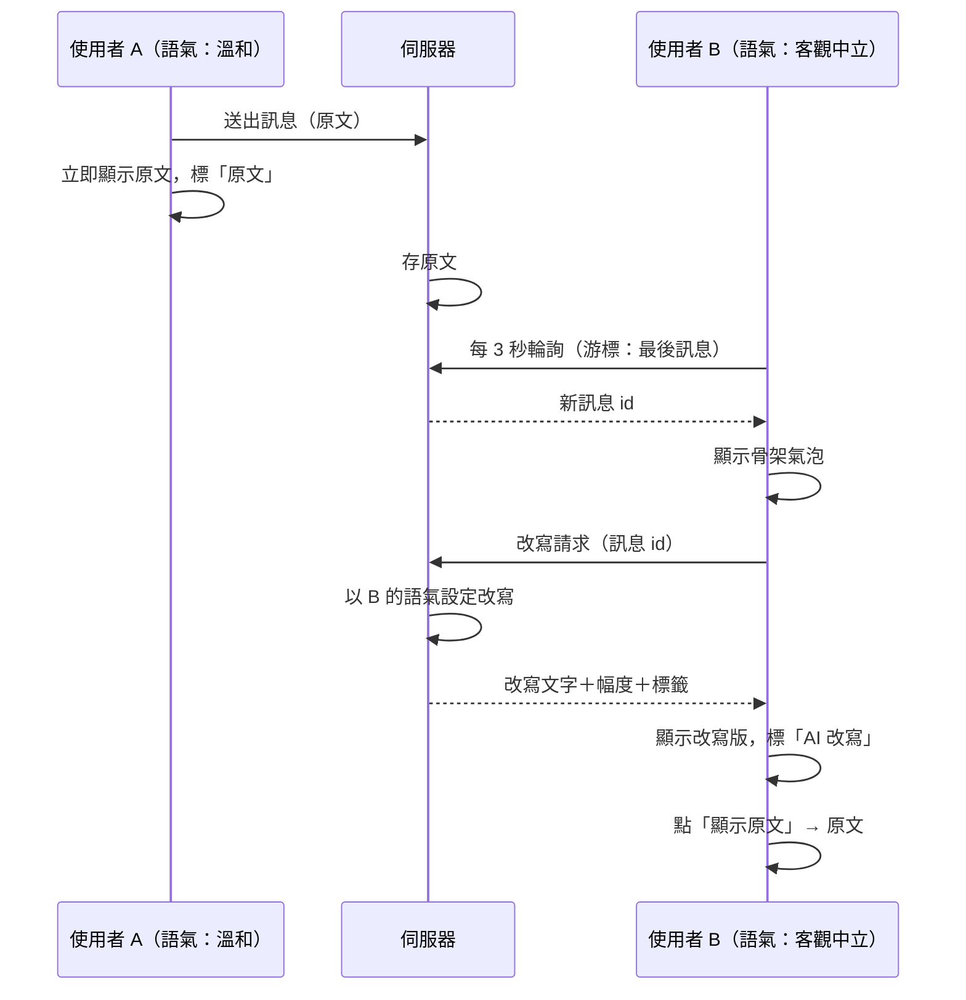

## 1. 背景與問題（Why）

私訊是語氣層最貼身的場景：一對一對話裡的用字最容易起衝突，也最能展示「同一句話在兩支手機上長得不一樣」。本 PRD 定義最小的 1：1 聊天室：使用者列表當入口、短輪詢拉訊息、對方訊息經改寫呈現。刻意不用 WebSocket——部署平台的 serverless 函式不支援長連線，引第三方即時服務對 demo 不划算。

## 2. 使用者與場景

- 當我想私下跟某人說話時，我想要從使用者列表點他就開始對話，以便不用搜尋。
- 當對方訊息語氣激烈時，我想要看到的是我設定的語氣，以便對話繼續得下去。
- 當我送出訊息時，我想要它立刻出現在畫面上、與我打的一字不差，以便確認送出成功。
- 當我懷疑對方訊息被改寫失真時，我想要點一下看原文，以便不誤會對方。

## 3. 需求細節

### 3.1 對話

| # | 功能／需求 | 完成目標 |
|---|---|---|
| 1 | 聊天分頁列出所有其他使用者，點任一人進入與他的 1：1 對話 | 沒有搜尋、沒有建立群組 |
| 2 | 每對使用者只有一個對話，首次點入時建立 | 兩人從各自端點入都到同一個對話 |
| 3 | 列表每列顯示對方頭像、顯示名稱、最後一則訊息時間；不顯示訊息內容預覽 | 列表載入不觸發任何改寫 |
| 4 | 列表依最後訊息時間排序，沒聊過的排在後面 | — |

### 3.2 訊息

| # | 功能／需求 | 完成目標 |
|---|---|---|
| 1 | 純文字，上限 500 字；送出即送，不可編輯、不可刪除 | 資料庫存的與輸入逐字相同 |
| 2 | 自己的訊息送出後立即顯示原文，標「原文」 | 不等伺服器回應即出現，失敗則標示重送 |
| 3 | 對方訊息經改寫呈現，改寫完成前顯示骨架氣泡；失敗顯示原文並標「原文」 | 不會先出現原文再跳成改寫版 |
| 4 | 每則對方訊息可「顯示原文」，一次性、不呼叫模型 | 行為依總覽 PRD 語氣層總則 |
| 5 | 改寫套用讀者的全站語氣設定，不能為單一對話另設 | 設定頁改語氣後，對話內既有訊息重新改寫 |
| 6 | 對話內訊息以時間序由舊到新顯示，進入時捲到最底 | 新訊息到達時若已在最底則自動跟隨 |

### 3.3 同步

| # | 功能／需求 | 完成目標 |
|---|---|---|
| 1 | 對話頁每 3 秒輪詢一次新訊息，以最後一則訊息為游標 | 對方送出後 3 秒內出現在本端 |
| 2 | 離開對話頁停止輪詢 | 背景不產生請求 |
| 3 | 對方訊息改寫的並發限制沿用語氣改寫引擎 PRD | 一次拉到多則舊訊息時不會瞬間全打出去 |
| 4 | 不做已讀、未讀、輸入中狀態 | — |

## 4. 流程圖

